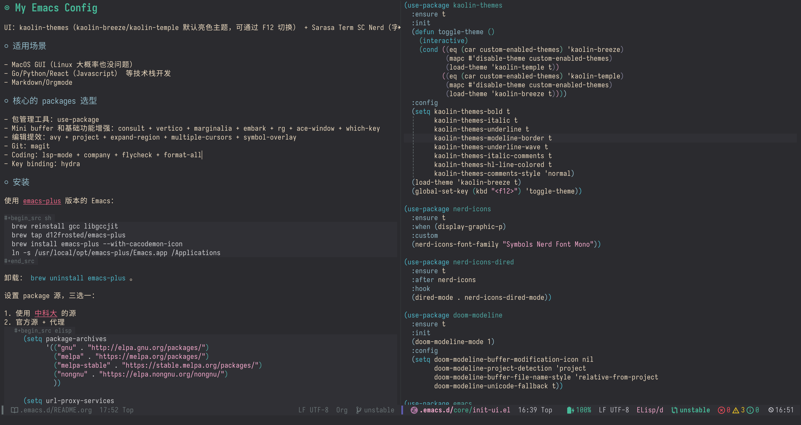
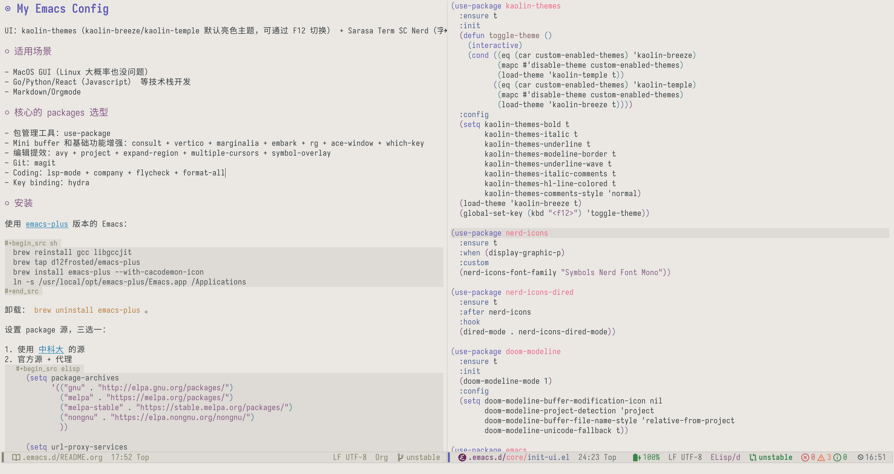

* My Emacs Config

UI：kaolin-themes（kaolin-breeze/kaolin-temple 默认亮色主题，可通过 F12 切换） + Sarasa Term SC Nerd（字体）。

** 适用场景

- MacOS GUI（Linux 大概率也没问题）
- Go/Python/React（Javascript） 等技术栈开发
- Markdown/Orgmode

** 核心的 packages 选型

- 包管理工具：use-package
- Mini buffer 和基础功能增强：consult + vertico + marginalia + embark + rg + ace-window + which-key
- 编辑提效：avy + project + expand-region + multiple-cursors + symbol-overlay
- Git：magit
- Coding：lsp-mode + company + flycheck + format-all
- Key binding：hydra

** 安装

使用 [[https://github.com/d12frosted/homebrew-emacs-plus][emacs-plus]] 版本的 Emacs：

#+begin_src sh
  brew reinstall gcc libgccjit
  brew tap d12frosted/emacs-plus
  brew install emacs-plus --with-cacodemon-icon
  ln -s /usr/local/opt/emacs-plus/Emacs.app /Applications
#+end_src

卸载： =brew uninstall emacs-plus= 。

设置 package 源，三选一：

1. 使用 [[https://mirrors.ustc.edu.cn/help/elpa.html][中科大]] 的源
2. 官方源 + 代理
   #+begin_src elisp
     (setq package-archives
           '(("gnu" . "http://elpa.gnu.org/packages/")
             ("melpa" . "https://melpa.org/packages/")
             ("melpa-stable" . "https://stable.melpa.org/packages/")
             ("nongnu" . "https://elpa.nongnu.org/nongnu/")
             ))

     (setq url-proxy-services
           '(("no_proxy" . "^\\(localhost\\|10.*\\)")
             ("http" . "127.0.0.1:1087")
             ("https" . "127.0.0.1:1087")))
   #+end_src
3. 使用 =http_proxy= 代理

其他：

1. rg： =brew install ripgrep=
2. 字体： =brew install --cask font-sarasa-nerd=
3. icon：打开 [[https://www.nerdfonts.com][nerdfont]] 下载 Symbols Nerd Font 安装即可 [fn:1]

** 开发环境

*** Go

1. 使用 lsp-mode，安装 [[https://github.com/golang/tools/tree/master/gopls][gopls]]
2. lint 设置：
   - 通过 gopls 支持的参数来定制。具体见：[[https://github.com/golang/tools/blob/master/gopls/doc/settings.md][gopls#setting.md]]，以如下方式注入：
      #+begin_src elisp
        (lsp-register-custom-settings
         '(("gopls.analyses.shadow" t)
           ("gopls.usePlaceholders" t)
           ))
      #+end_src
    - 或者 [[https://github.com/nametake/golangci-lint-langserver][golangci-lint-langserver]] 被安装之后，lsp lint 会自动选择 golangci-lint，[[https://github.com/zhangjie2012/dotfiles/blob/master/_golangci.yaml][我的配置]]
3. 安装 [[https://github.com/fatih/gomodifytags][gomodtags]] 用于自动生成/取消 json/yaml 上的 struct tag

*** TODO Python

- lsp-mode =python3 -m pip install 'python-lsp-server[all]'=
- lint =python3 -m pip install flake8=
- format =python3 -m pip install black=

*** React Web

_不用 lsp-mode。_

- eslint =npm install -g eslint=
- format =npm install -g prettier=

flycheck 配置 ESLint 经常出现各种奇奇怪怪的问题，从来没有一次性成功过，汇总的自查方法：

1. 全局安装 ESLint，我不使用项目中单独的配置
2. =(setq flycheck-javascript-eslint-executable "eslint")= 指定 eslint 路径
3. =flycheck-select-checker= 指定 ESLint
4. =flycheck-verify-setup= 查看二进制路径和配置文件是否生效
   - ESLint 全局配置文件在用户目录下，具体可以查看 ESLint 的文档，ESLint 一直更新可能会有变化
   - 我的配置在 https://github.com/zhangjie2012/dotfiles/blob/master/_eslintrc.json =ln -s dotfiles/_eslintrc.json .eslintrc.json= 添加软连接
5. 以上 Emacs 都没问题，但是检测不符合预期，要检查下用的是哪里的配置文件，以及配置文件是否有问题
   - =eslint --print-config file.js= 查看使用的配置文件是什么
   - =eslint file.js= 查看错误提示与 Emacs 是否相同
   - 看 eslint 报错，缺什么全局安装

核心思路是：先保证 eslint 本身运行没问题，再看 Emacs flycheck 配置是否正常。

** Footnotes

[fn:1] doom-mode-line 4.0.0 之后不再支持 all-the-icons 由 nerd-icons 代替
